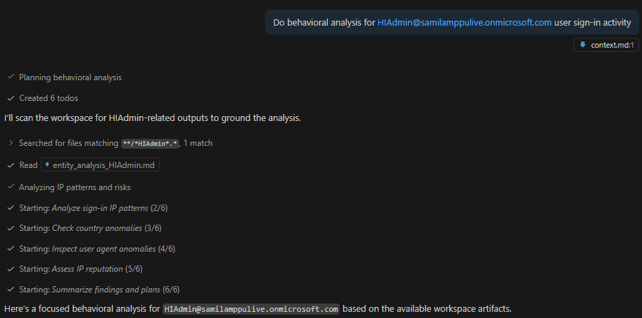
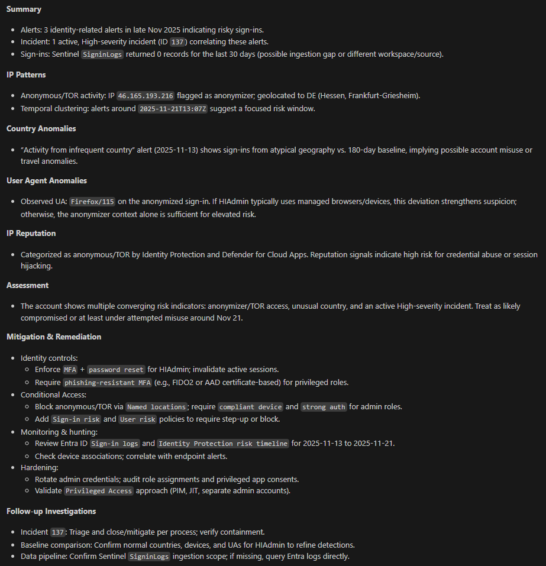
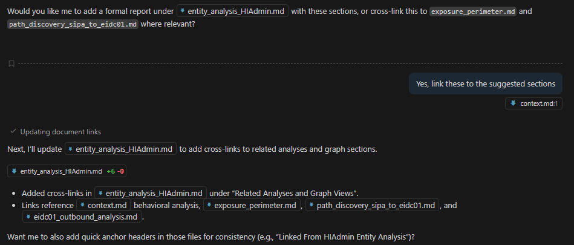
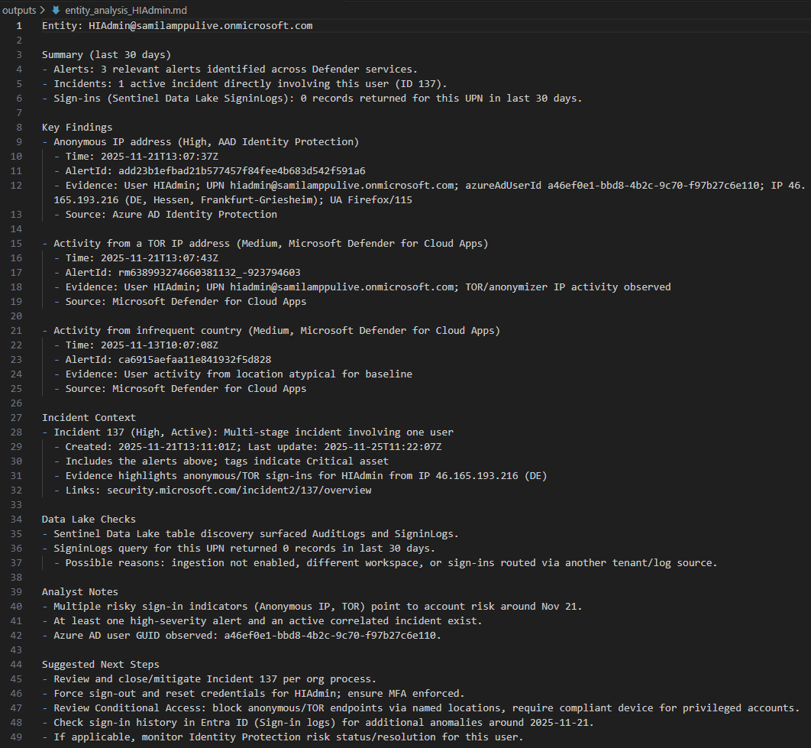
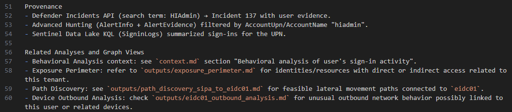

# Scenario: Behavioral analysis of user's sign-in activity

## Introduction
The goal with the scenario based approach is to enhance investigations and make retro-hunting repeatable, and fast by grounding Sentinel MCP data exploration with a concise, versioned context file that encodes scope, assumptions, and preferred analysis patterns. 

Behavioral analysis focuses on user sign-in activity (e.g., unusual IP diversity, geolocation changes, user agent anomalies, and IP reputation checks) using Microsoft Sentinel data lake via the [Sentinel MCP data exploration tool collection](https://learn.microsoft.com/en-us/azure/sentinel/datalake/sentinel-mcp-data-exploration-tool).

These instructions are evaluated primarily in VS Code with Copilot + Sentinel MCP, but also work in other MCP-enabled AI tools that can leverage the same context, including Microsoft Foundry, Copilot Studio, Microsoft Security Copilot, and OpenAI ChatGPT.

## Expected Outputs
- Ranked users by distinct sign-in IP addresses.
- Geolocation anomalies (e.g., new or rare countries for a user).
- Suspicious user agent patterns or changes.
- IP reputation assessment summaries.
- Consolidated summary with mitigation and remediation recommendations.

## When to use?
- Behavioral Analysis Flow: Uses search_tables + query_lake to explore long-term data with KQL across UEBA-related tables like BehaviorAnalytics, Anomalies, AADUserRiskEvents, and UserPeerAnalytics. It’s analyst-driven, synchronous, and suited for broad hunts and trend discovery.
- Behavioral flow: Broad discovery, hypothesis testing, custom KQL, trend and population analytics.

## Scenario Flow & Instructions
The following section contains instructions for the MCP server. Copy and paste them into `context.md` and use with your preferred MCP client and an LLM to get the most out of it. 

## Behavioral analysis of user's sign-in activity – Instructions and investigation flow to use with Sentinel MCP server
Retrieve users with distinct IP addresses
- When asked, start by retrieving all users who have the most distinct IP addresses using sign-in.
Check for country-based anomalies
- Next, check if the top 3 users have been signing in from a different country.
Inspect user agent anomalies
- Then, check for anomalies in the user agent settings used to sign in to devices to see if there is anything malicious.
Verify IP reputation
- Last, check the reputation of the IP addresses that were used to sign in for maliciousness.
Summarize and provide plans
- Summarize all steps taken in a way that helps readers understand. Also, add mitigation and remediation plans.

Figure 1: Behavioral analysis of a user entity in VS Code using the Sentinel Data Exploration MCP tools.

  
 

Figure 2: Summary view highlighting anomalous IP diversity, geo changes, and user-agent signals.

  
 

Figure 3: Assistant-suggested next steps for mitigation, follow-up queries, and monitoring improvements.

  
 

 Figures 4 & 5: Adding add cross-links to earlier analysis and graph sections that were executed earlier.
 

  
 

 

  
 

 References to find out more information:

- [Microsoft Sentinel MCP Server - Overview](https://learn.microsoft.com/en-us/azure/sentinel/datalake/sentinel-mcp-overview)

- [Microsoft Sentinel MCP Server - Tool Collection](https://learn.microsoft.com/en-us/azure/sentinel/datalake/sentinel-mcp-tools-overview)

- [Sentinel MCP data exploration collection](https://learn.microsoft.com/en-us/azure/sentinel/datalake/sentinel-mcp-data-exploration-tool)