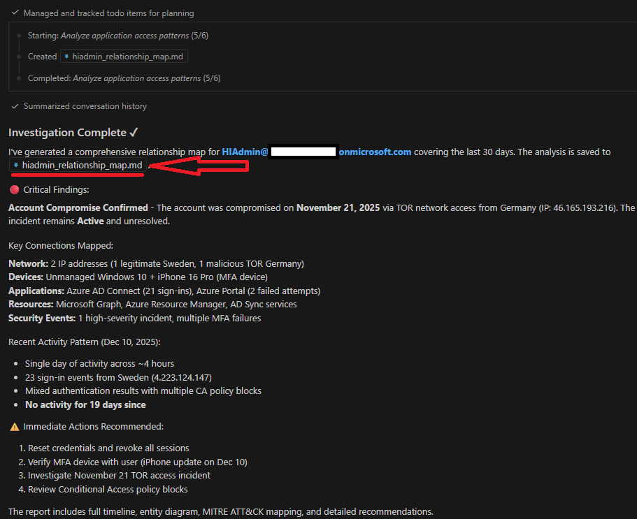
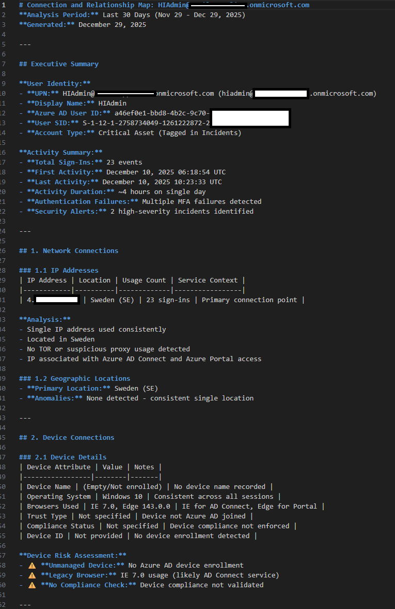
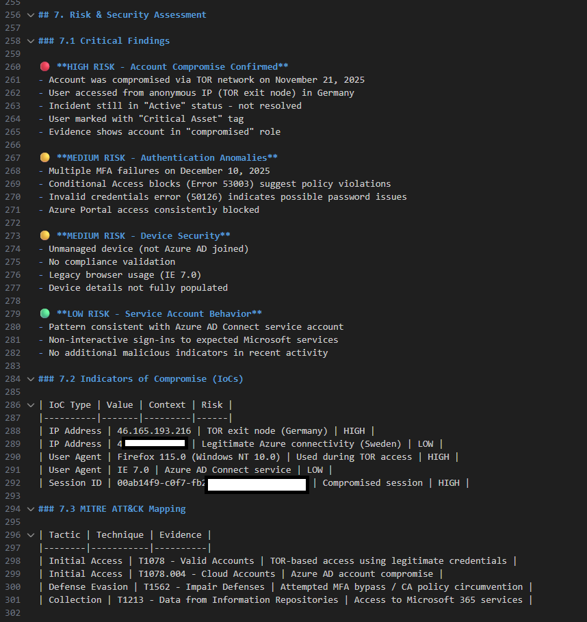
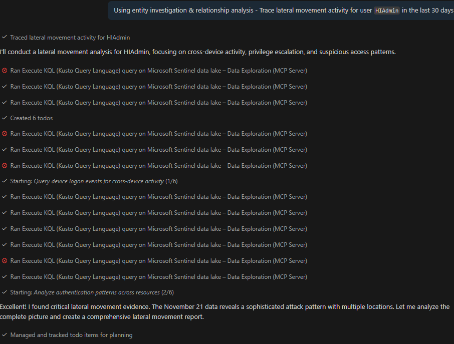
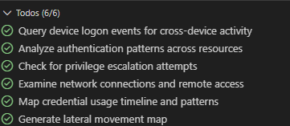
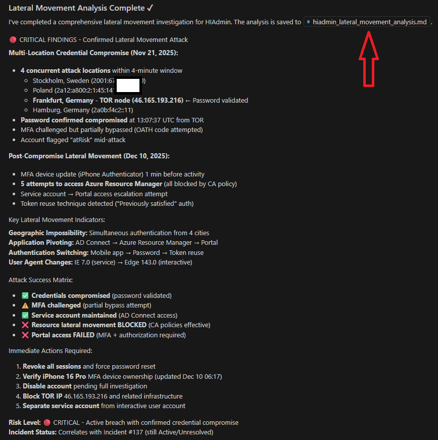
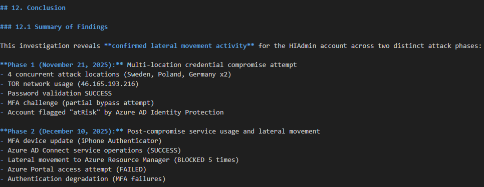

# Scenario: Entity Investigation & Relationship Analysis
This guide shows you how to use Microsoft Sentinel MCP server tool collections and Microsoft MCP Server for Enterprise to analyze user account and its relationships through MCP client, MCP server and LLM (GitHub Copilot).

## Introduction

**Entity Investigation & Relationship Analysis** uses natural language-driven investigation workflows to discover entity connections, activity patterns, and security signals across Microsoft Sentinel's data lake. Through simple prompts, the MCP client and LLM automatically discover relevant tables and retrieve data, allowing analysts to explore relationships, map lateral movement, and investigate any entity type across any timeframe without writing queries.

### What Entity Investigation Does

Entity Investigation leverages Sentinel MCP Data Exploration tools through natural language prompts:

- **`search_tables`**: Automatically discovers relevant data lake tables based on investigation context, returning schema definitions for the LLM to use
- **`query_lake`**: Automatically executes queries against Sentinel data lake to retrieve security events, alerts, assets, identities, devices, and enrichment data
- **Microsoft MCP Server for Enterprise** (optional): Enriches investigations with Entra ID user information, group memberships, manager relationships, and organizational context

You guide the investigation with natural language instructions, and the MCP client orchestrates the appropriate tool calls, generates necessary queries, and returns results. This approach is flexible and supports comprehensive investigations across all entity types including users, devices, IPs, file hashes, URLs, and domains without time window restrictions.


### Key Benefits

- **Full Entity Coverage**: Investigate users, devices, IPs, file hashes, URLs, domains - any entity type
- **Unlimited Timeframes**: No 7-day window restriction - explore historical data across any time period
- **Natural Language Driven**: Guide investigations with simple prompts, no query writing required
- **Relationship Mapping**: Discover connections, lateral movement paths, and entity blast radius
- **Flexible Discovery**: Automatically find relevant tables without knowing exact schema
- **Deep Forensics**: Reconstruct process chains, network flows, and attack timelines
- **Iterative Exploration**: Pivot to related entities, follow leads, and adapt investigation flow dynamically


## When to use?

- **Entity Investigation**: Natural language-driven investigation using `search_tables` + `query_lake` for any entity type (users, devices, IPs, file hashes, URLs). Best for relationship mapping, lateral movement analysis, historical investigations beyond 7 days, deep forensics, and iterative exploration across entity types not supported by Entity Analyzer.
- **Entity Analyzer** (Preview): AI-powered asynchronous analysis for specific users or URLs only. Returns standardized verdicts and narrative analysis within 7-day window. Best for fast triage, automated risk assessment, and quick entity enrichment when AI-generated verdicts are sufficient.


## Using Entity Investigation

**Supported entity types:**
- Users (Microsoft Entra object ID, UPN, account name)
- Devices (device name, device ID)
- IP addresses (IPv4, IPv6)
- File hashes (MD5, SHA1, SHA256)
- URLs and domains
- Processes (process name, command line)

**What you get:**
- Entity relationship maps (connected users, devices, IPs, processes)
- Alert and incident associations
- Activity timelines and patterns
- Lateral movement indicators
- Process execution chains
- Network communication patterns
- Enrichment from Entra ID (optional)

**How it works:**
1. Provide natural language investigation prompts (e.g., "map connections for this user", "find alerts for this IP")
2. MCP client automatically discovers relevant tables using `search_tables`
3. LLM generates and executes appropriate queries via `query_lake`
4. Results are returned and can be enriched with Microsoft MCP Server for Enterprise
5. Continue investigation by pivoting to related entities with follow-up prompts


## Entity Investigation & Relationship Analysis – Instructions and investigation flow to use with Sentinel MCP Server (Data Exploration & Triage tools) and Microsoft MCP Server for Enterprise

Use Sentinel MCP Server (Data Exploration & Triage tools) to discover and query security data, and optionally Microsoft MCP Server for Enterprise to enrich user entities with organizational context.

Map entity connections and activity timeline
- Discover relevant tables and query to build relationship maps showing connected entities and activity patterns over time for any entity (user, device, IP, file hash, or URL).

Discover alerts and incidents linked to an entity
- Retrieve all alerts and incidents associated with a specific entity by searching for and querying relevant security tables filtered by entity identifiers.

Analyze lateral movement and access patterns
- For suspected compromised entities, trace authentication, logon, and network activity to identify unusual access paths, privilege escalation, or lateral movement.

Investigate file or process activity chains
- For suspicious files or processes, query process and file events to reconstruct execution chains, parent-child relationships, and persistence mechanisms.

Correlate network communications with threat intelligence
- When investigating IPs or domains, correlate network events with threat indicators to identify C2 connections or malicious infrastructure.

Summarize entity blast radius and risk
- Analyze and summarize observable connections, highlight high-risk relationships, quantify scope, and recommend investigation priorities or containment actions.


### Investigation Flow Mapping
The Entity Investigation follows a standard MCP workflow that can be triggered through natural language prompts:

#### Flow Pattern
```
User Prompt (Natural Language)
    ↓
MCP Client Processes Intent
    ↓
Tool: search_tables (Discovers relevant data lake tables)
    ↓
LLM Reviews Table Schemas
    ↓
Tool: query_lake (Executes KQL queries against discovered tables)
    ↓
Results Returned (Security events, alerts, relationships, etc.)
    ↓
[Optional] Microsoft MCP Server for Enterprise (Entra ID enrichment)
    ↓
LLM Analyzes & Presents Findings
    ↓
[Optional] User Follow-up Prompts (Pivot to related entities)
```

### Sample Prompts
- "Map all connections and relationships for user `<UPN or object ID>` over the last 30 days"
- "Find all alerts and incidents associated with device `<device name>`"
- "Trace lateral movement activity for user `<account name>` in the last 14 days"
- "Show me process execution chains for suspicious file hash `<SHA256>`"
- "Investigate IP address `<IP>` and correlate with threat intelligence indicators"
- "Summarize the blast radius and risk for compromised account `<UPN or object ID>`"
- "What devices and IPs has user `<UPN>` accessed in the last 90 days?"
- "Find all network communications from `<IP>` to external domains and check for C2 activity"


## Scenario 1 - Example User Entity Investigation Flow
The following example scenario elaborates what you can achieve with MCP client & server together with LLM based tools.

Figure 1: An example entity investigation flow where user account relationships are identified. The output is saved on a separate file in the repository (where the tool is run) and is shown in figures 3-4 below.

<p align="center">
  
 </p>

Figure 2: Investigation summary showing completed analysis. The output file contains all the details from the investigation and has total of 12 different sections.
<p align="center">
  
 </p>


Figure 3: The most beneficial information is in the output file (HIAdmin relationship map). The output has several sections - starting from investigated entity overview and basic account information.
<p align="center">
  
 </p>

Figure 4: HIAdmin relationship map - Risk assessment and blast radius summary.
 <p align="center">
  
 </p>

---

## Scenario 2 - Trace lateral movement activity for user HIAdmin in the last 30 days

Figure 5: Starting to trace lateral movement activity for targeted user entity HIAdmin. 

*Side note: On the figure below, unsuccessful KQL queries created by LLM are seen with red cross at the front of them.*
 <p align="center">
  
 </p>

Figure 6: MCP client automatically created investigation todos showing planned analysis steps.
 <p align="center">
  
 </p>

 Figure 7: Investigation summary clearly shows the analysis results and output file for detailed findings.
  <p align="center">
  
 </p>

  Figure 8: Investigation conclusion from the output file. The last section summarizes the attack sequence and two phases of the attack. In total, the output file contains 12 sections.
  <p align="center">
  
 </p>